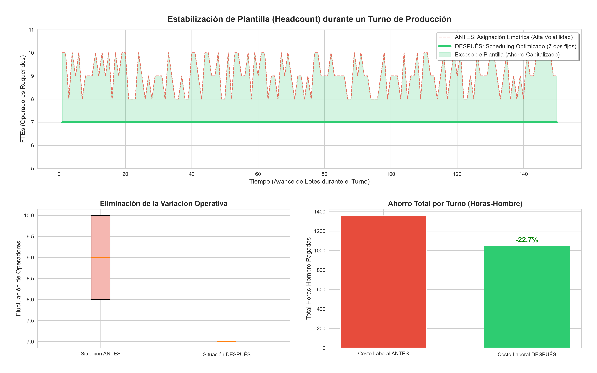

# 🏭 Dynamic Capacity & Production Scheduler (Operations Research)

## 1. El Desafío del Negocio (Business Context)
En la manufactura automotriz Tier-1, operar un sistema de pintura continuo (carrusel de 127 posiciones) con una mezcla de alta volatilidad (804 SKUs para clientes como **Tesla, Ford, Toyota, Nissan y Honda**) genera una inestabilidad extrema en el balanceo de personal. 

El modelo de asignación tradicional ("empírico") reaccionaba a los picos de demanda lote por lote, requiriendo hasta 10 operadores por turno y generando grandes valles de ociosidad. Tras un análisis de tiempos y movimientos, se desmitificaron las restricciones del sistema:
1. **Falsa restricción (Color Change):** El cambio de color no requiere detener la línea; el robot solo necesita 2 pallets vacíos (1.57% de pérdida de capacidad) para la purga.
2. **Restricción Real (Rack Overspray):** El verdadero cuello de botella es el engrosamiento de pintura en los pallets por alta densidad, lo que dificulta la carga/descarga e incrementa los tiempos estándar.

## 2. Solución: Analítica Prescriptiva & Operations Research
Se desarrolló un modelo matemático de *Scheduling Óptimo* en Python utilizando **optimización heurística orientada a objetos (OOP)**, abandonando por completo la asignación empírica. 
* El algoritmo secuencia los lotes agrupando densidades similares (piezas por rack) para aplanar la varianza y estabilizar la carga de trabajo ergonómica.
* Minimiza los saltos de color ordenando la secuencia, respetando la restricción de purga del robot sin afectar el *throughput*.

## 3. Impacto Financiero y Operativo (ROI)
* **Eliminación de la Varianza:** La fluctuación de personal pasó de saltos descontrolados (5 a 10 operadores) a una línea completamente estable y predecible.
* **Eficiencia Laboral (Ahorro del 22.7%):** Se logró estabilizar la plantilla en **7 operadores fijos**. El cálculo matemático exigía 6, pero **se asignó 1 operador comodín (Float/Relief)** para absorber la variabilidad real del OEE (descansos, micro-paros, fallas menores). 
* **Gestión del Cambio & Cross-training:** La optimización no implica despidos, sino la reubicación estratégica de FTEs hacia cuellos de botella en otras áreas (ej. ensamble) y la reducción de horas extras. Esto exige una matriz de polivalencia (cross-training) para la cuadrilla de 7 operadores.

## 4. Arquitectura y Ciberseguridad (Compliance)
* **Data Privacy & SecOps:** Para proteger el secreto industrial (NDA) y la topología de la cadena de suministro de los OEMs, no se exponen datos reales del piso de producción. El pipeline se ejecuta en entornos virtuales aislados (`.venv`), bloqueando el rastreo de credenciales locales (`.gitignore` sobre archivos `.env`), y utilizando generadores de datos *dummy* que simulan la matemática exacta de la planta.
* **Tech Stack:** Python, Pandas (Data Manipulation), Matplotlib/Seaborn (Data Visualization).

---
### 📊 Dashboard de Resultados (Optimización de Varianza)

